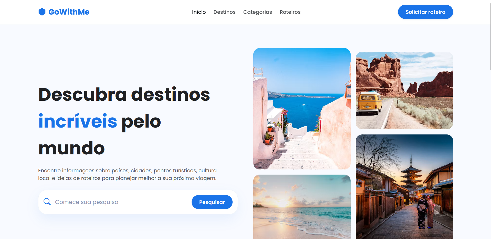

# 🛫 GoWithMe

<p align="center">
  
</p>

## 🇧🇷 Português

**GoWithMe** é um portal de viagens desenvolvido para inspirar pessoas a descobrirem novos destinos ao redor do mundo. A plataforma reúne informações sobre países, cidades, pontos turísticos e diferentes estilos de viagem, oferecendo uma experiência moderna e intuitiva para pesquisar lugares, explorar categorias e solicitar roteiros personalizados.

### ✨ Funcionalidades

- 🔍 Pesquisa de destinos
- 🌍 Exploração por categorias
- 🏞️ Destinos em destaque
- 🗺️ Solicitação de roteiros personalizados
- 💬 Feedback de viajantes
- 📱 Interface responsiva

### 🚀 Tecnologias

- HTML5
- CSS3
- Bootstrap 5
- JavaScript

---

## 🇺🇸 English

**GoWithMe** is a travel portal designed to inspire people to discover amazing destinations around the world. The platform provides information about countries, cities, tourist attractions, and different travel experiences through a modern and intuitive interface.

### ✨ Features

- 🔍 Destination search
- 🌍 Travel categories
- 🏞️ Featured destinations
- 🗺️ Personalized itinerary requests
- 💬 Traveler feedback
- 📱 Responsive interface

### 🚀 Technologies

- HTML5
- CSS3
- Bootstrap 5
- JavaScript

---

## 📂 Project Structure

```text
GoWithMePortal/
│
├── index.html
├── css/
├── js/
├── img/
└── README.md
```

---

## 👩‍💻 Author

Developed with by **Gabriela Nunes**

- GitHub: https://github.com/gabrielatofoli
- LinkedIn: https://www.linkedin.com/in/gabrielatofolinunes/